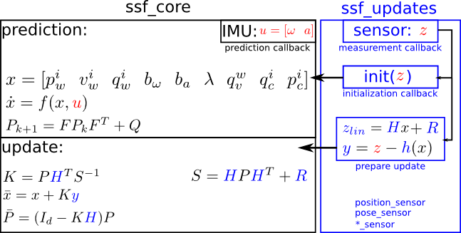
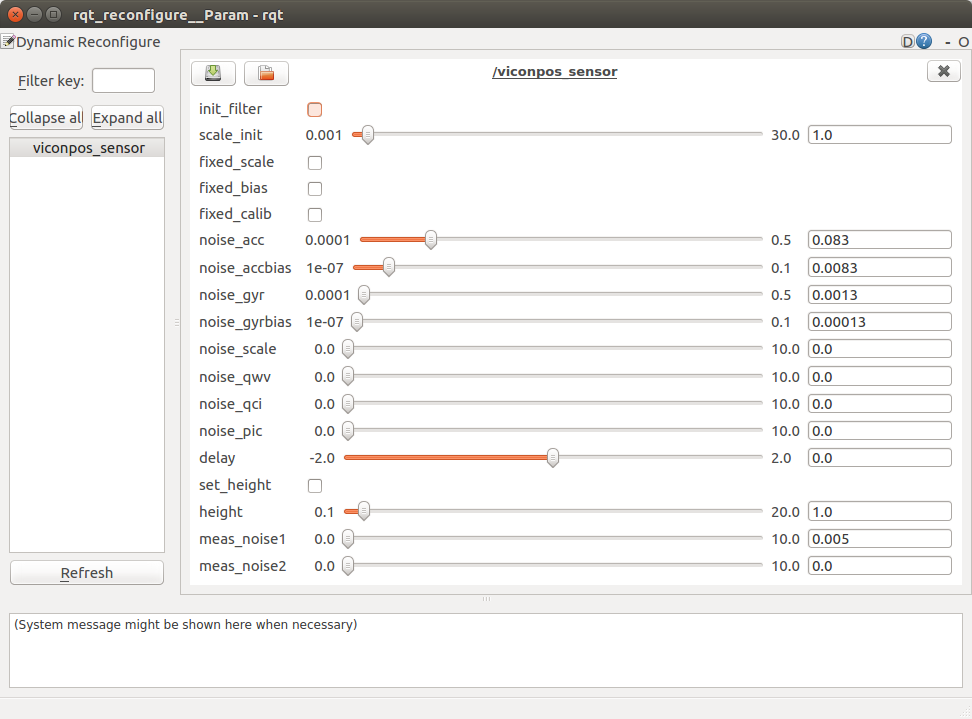
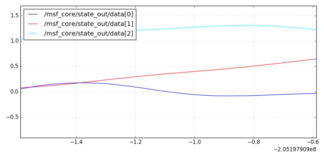

# ethz-asl SSF & MSF

Modified version of **[ethzasl_msf](https://github.com/ethz-asl/ethzasl_msf)** (commit 5d91612  on May 1, 2018), a sensor fusion framework based on an Extended Kalman Filter (EKF) for 6DOF pose estimation including intrinsic and extrinsic sensor calibration.

* MSF: Modular framework for multi sensor fusion based on an Extended Kalman Filter (EKF)

* Wiki
   - http://wiki.ros.org/ethzasl_sensor_fusion
   - https://github.com/ethz-asl/ethzasl_msf/wiki

* API: http://ethz-asl.github.io/ethzasl_msf

* Paper
  ```bibtex
  @INPROCEEDINGS{lynen13robust,
     Author = {S Lynen and M Achtelik and S Weiss and M Chli and R Siegwart},
     Title = {A Robust and Modular Multi-Sensor Fusion Approach Applied to MAV Navigation},
     Booktitle = {Proc. of the IEEE/RSJ Conference on Intelligent Robots and Systems (IROS)},
     Year = {2013}
  }
  ```

<p align="center">
  
</p>

-----

[TOC]

## Install & Build
  ```sh
  mkdir -p ws_msf/src
  cd ws_msf/src

  git clone <the-project>

  # install dependencies
  cd ..
  wstool init src/ src/ethzasl_msf/dependencies.rosinstall

  # build
  catkin_make
  ```

## Run

### SSF

#### the SSF Viconpos Sensor Example

1. start ssf_updates
   ```sh
   roslaunch ssf_updates viconpos_sensor.launch
   ```

2. init filter by click **init_filter** on Config GUI
   ```sh
   rosrun rqt_reconfigure rqt_reconfigure
   ```
   <p align="center">
     
   </p>

3. play back dataset  ([dataset.bag](http://wiki.ros.org/ethzasl_sensor_fusion/Tutorials/Introductory%20Tutorial%20for%20Multi-Sensor%20Fusion%20Framework?action=AttachFile&do=view&target=dataset.bag)) in pause mode and from t=25s on
    ```sh
    rosbag play --pause -s 25 dataset.bag
    ```  
    
4. plot result data
   ```sh
   rosrun ssf_core plot_relevant
   ```     

#### ORB-SLAM2 (Stereo) + EuRoC V1_01_easy.bag

1. start ssf_updates
   ```sh
   roslaunch ssf_updates pose_sensor_orbslam2_euroc.launch
   ```

2. init filter by click **init_filter** on Config GUI
   ```sh
   rosrun rqt_reconfigure rqt_reconfigure
   ```

3. start orb-slam2 (https://github.com/cggos/orbslam2_cg)
   ```sh
   # pose cov:
   # sigma_pv: 0.001
   # sigma_rp: 0.5
   # sigma_yaw: 0.5
   roslaunch orbslam2_ros run_stereo_euroc.launch bag:=false
   ```

4. play back dataset
   ```sh
   rosbag play V1_01_easy.bag
   ```

### MSF

#### the MSF Viconpos Sensor Example

1. start msf_updates
   ```sh
   roslaunch msf_updates viconpos_sensor.launch
   ```

2. play back dataset  ([dataset.bag](http://wiki.ros.org/ethzasl_sensor_fusion/Tutorials/Introductory%20Tutorial%20for%20Multi-Sensor%20Fusion%20Framework?action=AttachFile&do=view&target=dataset.bag)) in pause mode and from t=25s on
   ```sh
   rosbag play --pause -s 25 dataset.bag
   ```
3. plot result data
   ```sh
   rqt_plot msf_core/state_out/data[0]:data[1]:data[2]   # Positions
   ```
   <p align="center">
     
   </p>

## Docs

* `doxygen msf_dox.dox`

## TODO

* Multiple fuzzy tracking states
* extern templates c++11
* Eigen::Map wrap Q-blocks (if possible)
* Multiplication of F blockwise
* Obs-constrainted EKF prediction
* symm P: EV decompose P, set EVs<eps to zero and rebuild (profile this to know the cost!)
* make sensor_manager provide interface to add measurement to core, so that measurements dont need to include the core, but just the base manager class.
* use more polymorphism to reduce compilation time and break up dependencies
* plot_scripts autogen with correct indices from msf_core
* TRUE MODULARITY:
  - template sensors to calibration states
  - Every sensor has a set of states (calib bias etc) these get added to a large state vector automatically.
